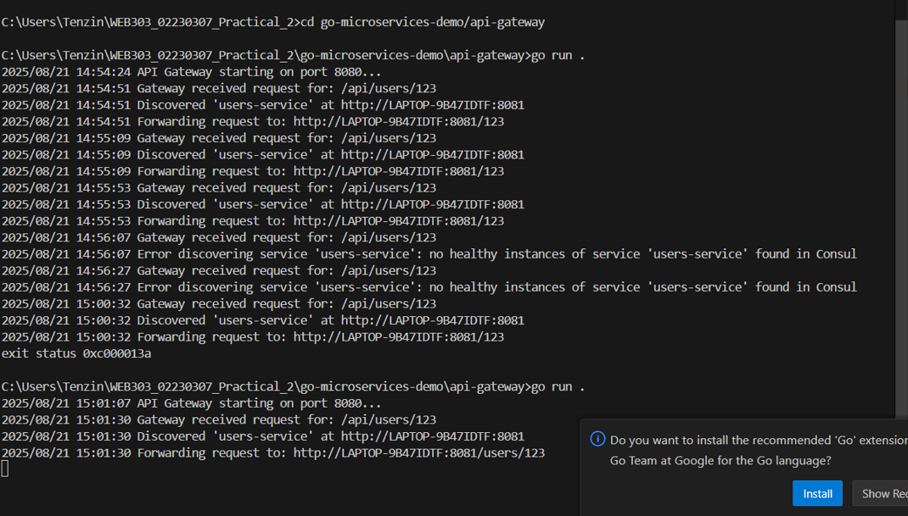

### WEB303 Practical 2: API Gateway with Service Discovery

I completed this practical to build a microservices ecosystem with service discovery capabilities. The project demonstrates how independent services can communicate through an API Gateway without knowing about each other directly, using Consul as a service registry.

#### Architecture

I implemented a system consisting of:

- API Gateway: Single entry point that routes requests to appropriate services
- Service Discovery (Consul): Central registry that tracks all running services and their health
- Users Service: Microservice handling user-related operations
- Products Service: Microservice handling product-related operations


#### Repository Structure

```
go-microservices-demo/
├── api-gateway/
│   ├── main.go
│   └── go.mod
├── services/
│   ├── users-service/
│   │   ├── main.go
│   │   └── go.mod
│   └── products-service/
│       ├── main.go
│       └── go.mod
├── README.md

```

#### Installation and Setup
I ensured the following tools were installed:

- Go 1.18 or higher
- Docker and Docker Compose
- cURL or Postman for testing

#### Dependencies
For each service, I installed the following Go packages:

```
go get github.com/go-chi/chi/v5
go get github.com/hashicorp/consul/api

```

#### Implementation Details

***Service Registry (Consul)***

- I set up Consul as a Docker container to serve as the service registry:
bashdocker run -d -p 8500:8500 --name=consul hashicorp/consul agent -dev -ui -client=0.0.0.0

***Users Service***

I implemented the users service with:

- Service registration with Consul on startup
- Health check endpoint for Consul monitoring
- REST endpoint for user operations
- Automatic service discovery integration

***Key Features***:

- Runs on port 8081
- Registers itself as "users-service" in Consul
- Provides /health endpoint for health checks
- Handles /users/{id} requests

***Products Service***

I created the products service following the same pattern:

- Nearly identical to users service but with different endpoints
- Runs on port 8082
- Registers as "products-service" in Consul
- Handles /products/{id} requests

***API Gateway***
I built the API Gateway as a smart reverse proxy that:

- Receives all external requests on port 8080
- Dynamically discovers services through Consul
- Routes requests based on URL patterns
- Forwards requests to healthy service instances

#### Running the System

I follow these steps to run the complete system:

#### Step 1: Start Consul

```
docker run -d -p 8500:8500 --name=consul hashicorp/consul agent -dev -ui -client=0.0.0.0
```

#### Step 2: Start Users Service
```
cd services/users-service
go run .
```

#### Step 3: Start Products Service

```
cd services/products-service
go run .
```

#### Step 4: Start API Gateway

```
cd api-gateway
go run .
```

#### Step 5: Verify in Consul UI
I navigate to http://localhost:8500 to confirm both services are registered and healthy.

#### Testing the System
I tested the system using the following commands:

- Test Users Service
```
curl http://localhost:8080/api/users/123
# Expected: Response from 'users-service': Details for user 123
```

- Test Products Service
```
curl http://localhost:8080/api/products/abc
# Expected: Response from 'products-service': Details for product abc

```

#### Challenges Encountered
#### Challenge 1: Service Discovery Resolution
- Issue: Initially, I faced connectivity issues where the API Gateway couldn't reach services registered in Consul.
- Root Cause: The services were running on the host machine while Consul was running in a Docker container, causing address resolution problems.
- Solution: I resolved this by either:

```
Option 1: Installing Consul locally on the host machine
```

#### Challenge 2: Health Check Configuration
- Issue: Services were registering with Consul but showing as unhealthy.
- Solution: I ensured proper health check endpoint implementation and correct hostname resolution in the service registration.

### Screenshots : 

Consul UI showing registered services : 

.png>)


API Gateway terminal logs : 



Postman/cURL test results : 

- Request 1: Test Users Service : 

.png>)


- Request 2: Test Products Service : 

.png>)
