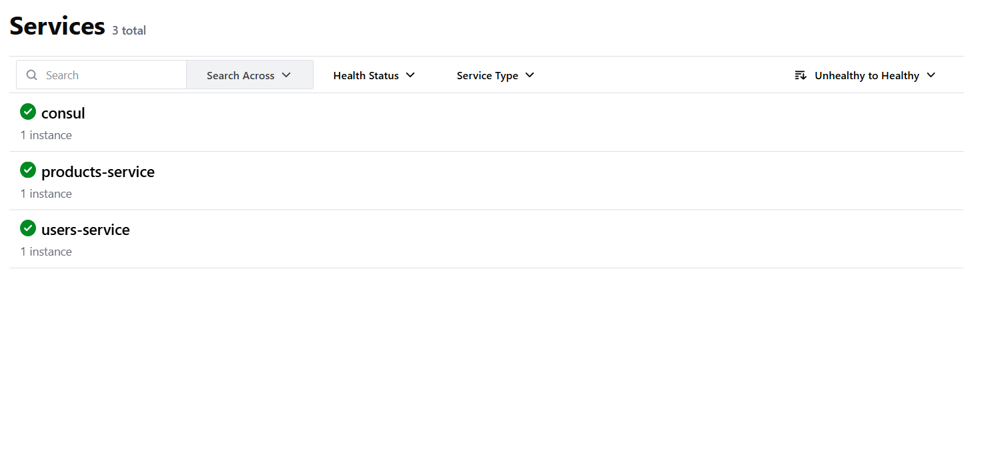
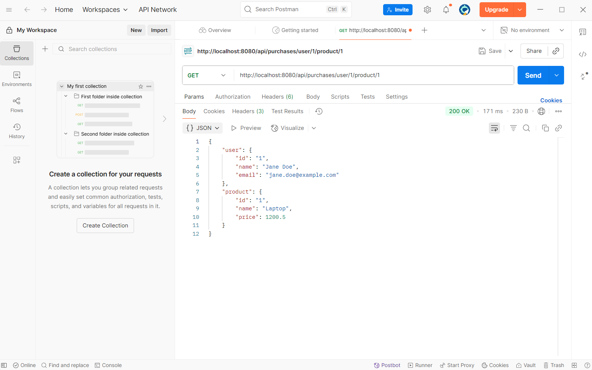
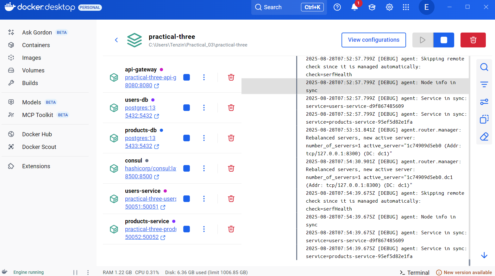

## Practical 3: Full-Stack Microservices with gRPC, Databases, and Service Discovery


### Project Overview
I have successfully completed the WEB303 Practical 3 assignment, which involved building a full-stack microservices ecosystem with gRPC communication, PostgreSQL databases, and Consul service discovery.


### System Architecture

 - API Gateway (Port 8080): HTTP REST interface with Consul service discovery
- Users Service (Port 50051): gRPC service managing user data
- Products Service (Port 50052): gRPC service managing product data
- Consul (Port 8500): Service registry and discovery
- PostgreSQL Databases: Separate databases for users and products


### Features Implemented

- Dynamic service discovery through Consul
- gRPC inter-service communication
- Data aggregation endpoint combining user and product information
- Individual CRUD operations for users and products
- Docker containerization for all services
- Database persistence with GORM ORM

### Critical Errors Encountered

#### 1. Database Startup Race Condition
- Problem: Services attempted to connect to PostgreSQL before databases completed startup and recovery.
- Symptoms:
```
FATAL: the database system is starting up (SQLSTATE 57P03)
products-service exited with code 1
users-service exited with code 1

```
- Root Cause: Docker containers started simultaneously without proper dependency ordering or health checks.

#### 2. Consul Service Discovery Configuration

- Problem: Services hardcoded 127.0.0.1:8500 for Consul connection instead of using Docker service names.

- Symptoms:
```
Failed to register with Consul: Put "http://127.0.0.1:8500/v1/agent/service/register": 
dial tcp 127.0.0.1:8500: connect: connection refused
```

- Root Cause: consulapi.DefaultConfig() defaults to localhost, which doesn't work in Docker networks.

####  3. API Route Mismatch
- Problem: API Gateway defined routes with /api prefix, but client requests used root paths.

Symptoms:
```
404 page not found

```

- Root Cause: Documentation or testing assumptions didn't match actual route definitions.

### Solutions Implemented
#### 1. Fixed Consul Service Discovery
- Before (Broken):

```
func registerServiceWithConsul() error {
    config := consulapi.DefaultConfig()  // Defaults to 127.0.0.1:8500
    consul, err := consulapi.NewClient(config)
    
```

- After (Fixed):
```
func registerServiceWithConsul() error {
    consulHost := os.Getenv("CONSUL_HOST")
    if consulHost == "" {
        consulHost = "localhost"  // Fallback for development
    }
    
    config := consulapi.DefaultConfig()
    config.Address = fmt.Sprintf("%s:8500", consulHost)  // Use environment variable
    consul, err := consulapi.NewClient(config)
    
}
```
#### 2. Database Connection Strategy
- Restarted services after databases completed startup

```
docker-compose restart products-service users-service
```

#### 3. API Gateway Route Discovery
***Solution***: Identified correct endpoint patterns by examining source code

- Routes use /api prefix: /api/users, /api/products
- Combined endpoint: /api/purchases/user/{userId}/product/{productId}


### API Endpoints
#### User Operations

- POST /api/users - Create a new user
- GET /api/users/{id} - Get user by ID

#### Product Operations

- POST /api/products - Create a new product
- GET /api/products/{id} - Get product by ID

#### Aggregated Data

-  GET /api/purchases/user/{userId}/product/{productId} - Get combined user and product data

### Testing Results
I have tested all endpoints using both cURL and Postman, with screenshots documenting:

- Service Registration: All services properly registered in Consul UI
- User Creation: Successfully created users via POST requests
- Product Creation: Successfully created products via POST requests
- Data Retrieval: Retrieved individual users and products by ID
- Aggregated Endpoint: Successfully fetched combined user-product data
- Service Discovery: Confirmed API Gateway discovers services through Consul

### Technologies Used

- Go - Primary programming language
- gRPC - Inter-service communication
- Protocol Buffers - Service contracts
- Consul - Service discovery and registry
- PostgreSQL - Database persistence
- GORM - ORM for database operations
- Docker & Docker Compose - Containerization and orchestration
- Gorilla Mux - HTTP routing


### Outputs : 

- Consul dashboard showing registered services (users-service, products-service, and Consul ).




- sample requests either via cUrl/Postman.




- Docker Desktop showing all services (api-gateway, users-service, products-service, users-db, products-db, and consul) running successfully.




