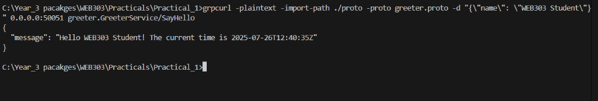

## WEB303 Practical 1 - Microservices with Go & gRPC

This is my first practical for microservices. I built two services that talk to each other using gRPC and Docker.

### What I Made

I created two microservices: 

**time-service** - gives you the current time
**greeter-service** - says hello and asks time-service for the time

Both services run in Docker containers and communicate through gRPC. 

### How I Built It 

**Step 1**: Created the proto files
I defined my services in .proto files first:

1. time.proto for the time service
2. greeter.proto for the greeter service

**Step 2**: Generated Go code

```
protoc --go_out=./proto/gen --go_opt=paths=source_relative --go-grpc_out=./proto/gen --go-grpc_opt=paths=source_relative proto/*.proto
```

This created all the gRPC Go files I needed.

**Step 3**: Set up Go module
```
go mod init practical-one
go get google.golang.org/grpc
go get google.golang.org/protobuf
```

**Step 4**: Wrote the services

1. time-service: Simple gRPC server that returns current time
2. greeter-service: Acts as both server (for client requests) and client (calls time-service)

**Step 5**: Dockerized everything

Created Dockerfiles for both services and a docker-compose.yml to run them together.

### Running My Project
Start the services:

```
docker-compose up --build
```

.png>)

Both services started successfully

### Test it:

```
grpcurl -plaintext -import-path ./proto -proto greeter.proto -d "{\"name\": \"WEB303 Student\"}" 0.0.0.0:50051 greeter.GreeterService/SayHello
```

### My result:



Successfully got response with current time

### Problems I Had & How I Fixed Them
**Problem 1** : Import path errors

I kept getting package practical-one/proto/gen is not in std error.

**What went wrong** : I had separate go.mod files for each service but they were trying to import from a shared module.

**How I fixed it** : Used a single root go.mod file instead of separate ones for each service.

### What I Learned

1. Single Go module is better for projects with shared proto files
2. Docker service names in docker-compose become hostnames (like time-service:50052)
3. gRPC services can be both client and server at the same time