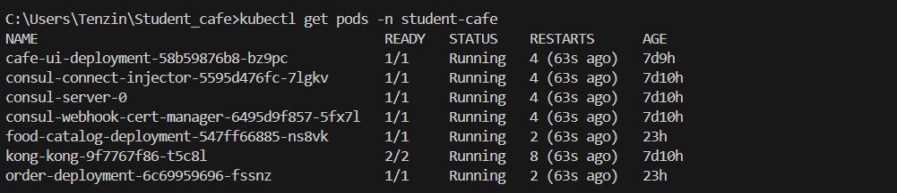
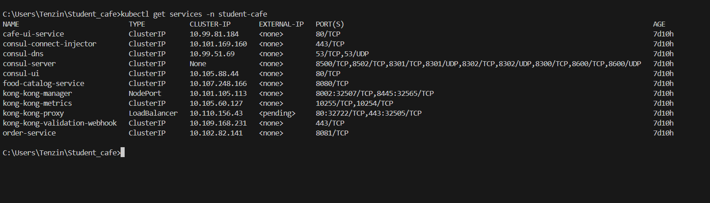
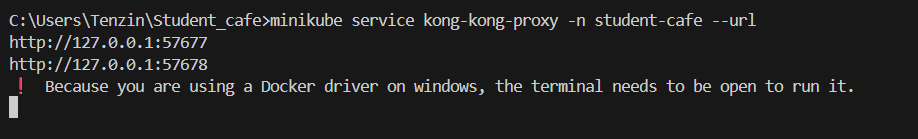
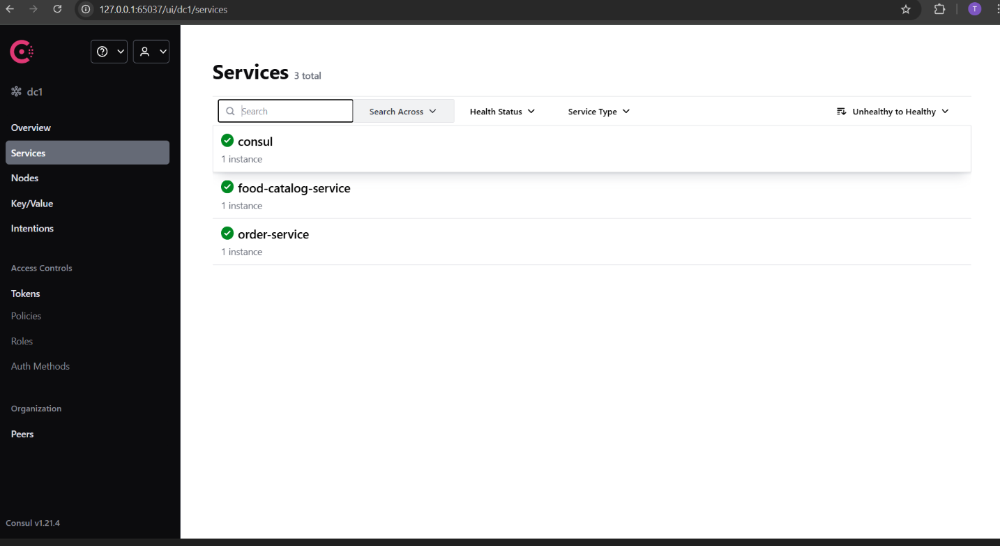

## Practical 4: Student Cafe

A microservices-based cafe ordering system built with Go backend services, React frontend, deployed on Kubernetes with Kong API Gateway and Consul service discovery.


### Project Overview

This project demonstrates a complete microservices architecture with:

- **Backend Services** : Two Go microservices for food catalog and order management
- **Frontend**: React-based user interface for browsing menu and placing orders
- **Infrastructure**: Kubernetes deployment with Kong API Gateway and Consul service registry
- **Containerization** : Docker containers for all services

### Architecture Components

**1. Microservices**
- Food Catalog Service (Port 8080): Manages menu items and provides food catalog API
- Order Service (Port 8081): Handles order creation and management

**2. Frontend**
- Cafe UI (Port 80): React-based web interface for customers

**3. Infrastructure**

- Kong API Gateway: Routes external requests to appropriate services
- Consul: Service discovery and health checking
- Kubernetes: Container orchestration and deployment platform


### Documentation

What Was Accomplished : 

1. Microservice Development

- Created two Go microservices using Chi router framework
- Implemented REST APIs for food catalog and order management
- Added health check endpoints for Kubernetes liveness probes
- Integrated Consul service discovery for inter-service communication
- Added CORS support for frontend-backend communication

2. Frontend Development

- Built React application for customer interface
- Implemented menu browsing and shopping cart functionality
- Added order placement with real-time feedback
- Configured API calls to backend services through Kong gateway

3. Containerization

- Created optimized multi-stage Dockerfiles for all services
- Used Alpine Linux base images for minimal container size
- Configured proper port exposures and health checks
- Built container images compatible with Kubernetes deployment

4. Kubernetes Deployment

- Deployed services using Kubernetes Deployments and Services
- Configured service discovery within cluster networking
- Set up proper resource limits and replica counts
- Implemented rolling update strategy for zero-downtime deployments

5. API Gateway Configuration

- Deployed Kong API Gateway using Helm charts
- Configured ingress routing for frontend and API endpoints
- Implemented path-based routing with strip-path functionality
- Set up CORS policies for cross-origin requests

6. Service Discovery

- Deployed HashiCorp Consul for service registry
- Configured automatic service registration and health checking
- Implemented service discovery in Go applications
- Added fallback mechanisms for service communication

### Key Features Implemented

- **Menu Browsing** - Display available food items with prices
- **Shopping Cart** - Add/remove items from order
- **Order Placement** - Submit orders with success/failure feedback
- **Service Communication** - Inter-service API calls for order validation
- **Health Monitoring** - Health check endpoints for all services
- **Load Balancing** - Kong gateway distributing requests
- **Service Discovery** - Automatic service location via Consul


### Screenshots Section

####  1.  React Frontend - Successful Order Placement


#### 2. Kubernetes Pods Status
```
 kubectl get pods -n student-cafe
```
Screenshot showing all pods in Running state including:



#### 3. Kubernetes Services Status
```
kubectl get services -n student-cafe
```


#### 4. Kong Services Status




#### 5. Consul UI - Service Registration



This demonstrates that:

- Both microservices successfully registered themselves with Consul
- Health checks are passing for all services
- Service discovery is functioning correctly
- Services can discover and communicate with each other through Consul


### Conclusion

This practical successfully demonstrated building and deploying a microservices-based cafe ordering system using Kubernetes, Kong API Gateway, and Consul service discovery. I created two Go microservices with a React frontend, containerized them with Docker, and deployed everything on Kubernetes.

The key achievement was getting all components working together - from service registration in Consul to API routing through Kong to successful order placement in the frontend. This hands-on experience with industry-standard tools provided practical knowledge of microservices architecture that will be useful for real-world cloud-native development.