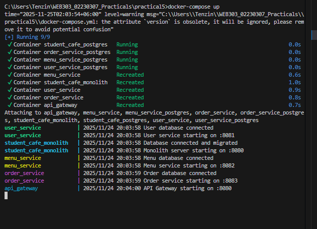
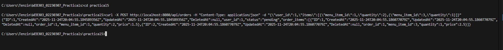
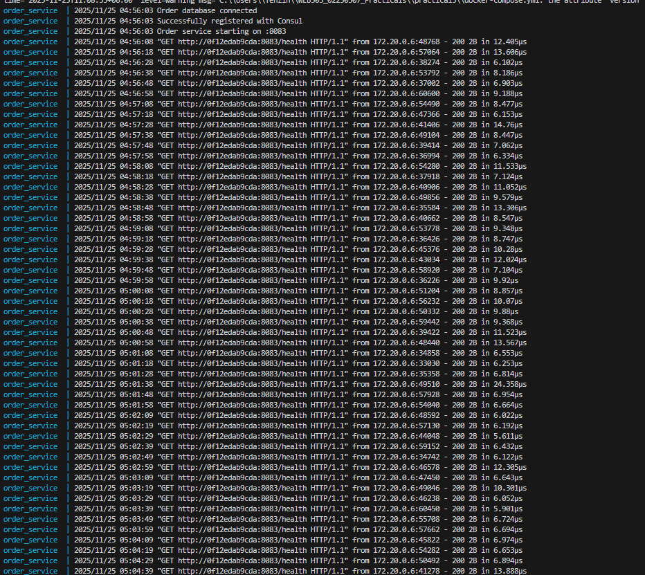
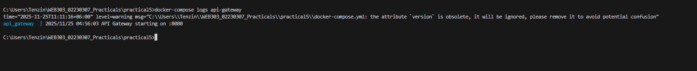
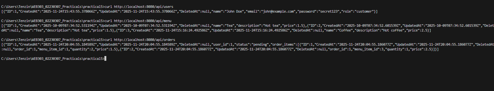
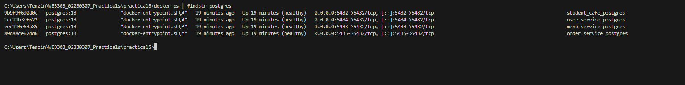
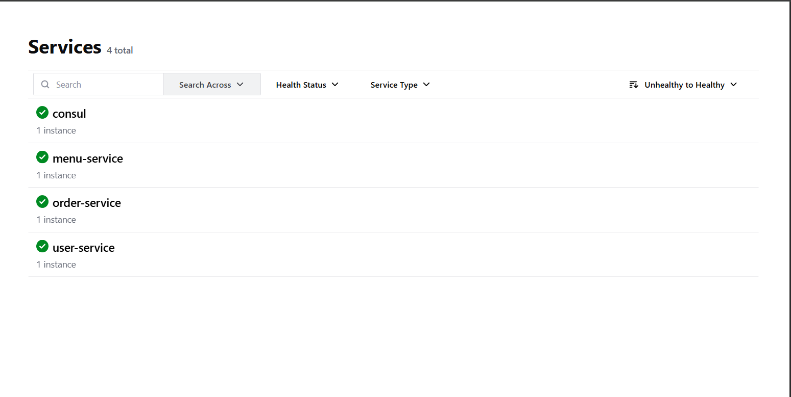

# Practical 5: Refactoring Monolithic Student Cafe to Microservices


## Table of Contents
1. [Project Overview](#project-overview)
2. [Architecture Diagram](#architecture-diagram)
3. [Service Boundaries Justification](#service-boundaries-justification)
4. [Implementation Details](#implementation-details)
5. [Setup and Running Instructions](#setup-and-running-instructions)
6. [Testing the Services](#testing-the-services)
7. [Screenshots](#screenshots)
8. [Challenges Encountered](#challenges-encountered)
9. [Reflection Essay](#reflection-essay)

---

## Project Overview

This project demonstrates the systematic refactoring of a monolithic Student Cafe application into a microservices architecture. The application manages users, menu items, and orders for a student cafe system.


## Architecture Diagram

### Final Microservices Architecture

```
┌─────────────────────────────────────────────────┐
│          API Gateway (:8080)                     │
│          Single Entry Point                      │
│   Routes: /api/users, /api/menu, /api/orders    │
└──────────┬──────────────┬─────────────┬─────────┘
           │              │             │
           ▼              ▼             ▼
   ┌──────────────┐ ┌──────────┐ ┌──────────────┐
   │User Service  │ │Menu Svc  │ │Order Service │
   │   :8081      │ │  :8082   │ │    :8083     │
   └──────┬───────┘ └────┬─────┘ └───┬──────────┘
          │              │            │
          │              │            │ (HTTP calls)
          │              │            ├────────────┐
          ▼              ▼            ▼            │
   ┌──────────┐   ┌──────────┐ ┌──────────┐      │
   │user_db   │   │menu_db   │ │order_db  │      │
   │ :5434    │   │ :5433    │ │ :5435    │      │
   └──────────┘   └──────────┘ └──────────┘      │
                                                   │
          ┌────────────────────────────────────────┘
          │
          └──► Inter-Service Communication:
               Order validates users & menu items via HTTP

┌─────────────────────────────────────────────────┐
│    Monolith (Legacy) - Port :8084                │
│    └── student_cafe DB (:5432)                   │
└─────────────────────────────────────────────────┘
```

### Database Architecture
Each microservice has its own dedicated PostgreSQL database:
- **user_db** (port 5434) - User data
- **menu_db** (port 5433) - Menu items
- **order_db** (port 5435) - Orders and order items
- **student_cafe** (port 5432) - Monolith database

---

## Service Boundaries Justification

### Domain-Driven Design Analysis

#### 1. User Service
**Bounded Context:** User Management  
**Entities:** User  
**Business Capability:** Manage customer profiles and authentication

**Why Separate?**
- Changes when user profile requirements change
- Scales independently during registration spikes
- User data is completely independent of menu and orders
- Can be replaced with third-party auth service (e.g., Auth0) without affecting other services

#### 2. Menu Service
**Bounded Context:** Menu Management  
**Entities:** MenuItem  
**Business Capability:** Maintain food catalog and pricing

**Why Separate?**
- Changes when menu items or prices are updated
- High read traffic (browsing menu) benefits from independent scaling
- Menu updates don't require redeploying order or user services
- Can cache menu data aggressively without affecting other services

#### 3. Order Service
**Bounded Context:** Order Management  
**Entities:** Order, OrderItem  
**Business Capability:** Process and track customer orders

**Why Separate?**
- Changes when order workflow changes (e.g., adding delivery options)
- Scales independently during peak ordering times (lunch rush)
- Requires coordination with user and menu services
- Maintains order history independently

### Service Dependencies
```
Order Service (Orchestrator)
    ├── Depends on → User Service (validates user_id)
    └── Depends on → Menu Service (validates menu_item_id, gets prices)

User Service (Independent)
    └── No dependencies

Menu Service (Independent)
    └── No dependencies
```

### Key Design Decisions

**1. Database-per-Service Pattern**
Each service owns its data exclusively. Order service stores only `user_id` and `menu_item_id` as references, not full objects.

**Benefits:**
- Services can evolve schemas independently
- Clear data ownership boundaries
- Easier to scale databases based on service load

**Trade-offs:**
- No database joins across services
- Must use API calls for validation
- Eventual consistency challenges

**2. HTTP/REST for Inter-Service Communication**
Order service validates dependencies via synchronous HTTP calls.

**Benefits:**
- Simple to implement and debug
- Language-agnostic (any service can call HTTP)
- Works well for request/response patterns

**Trade-offs:**
- Higher latency than direct database access
- Network failures require error handling
- Not suitable for high-frequency communication

**3. Price Snapshotting**
Order items store a snapshot of menu item prices at order time.

**Rationale:**
- Historical orders remain accurate if prices change
- Order service doesn't need to query menu service for past orders
- Supports business requirement: "orders reflect price at purchase time"

---

## Implementation Details

### User Service
**Port:** 8081  
**Database:** user_db (PostgreSQL on port 5434)  
**Endpoints:**
- `POST /users` - Create new user
- `GET /users/{id}` - Get user by ID
- `GET /users` - Get all users

**Key Features:**
- Email uniqueness constraint
- User profile management
- Independent deployment and scaling

### Menu Service
**Port:** 8082  
**Database:** menu_db (PostgreSQL on port 5433)  
**Endpoints:**
- `GET /menu` - Get all menu items
- `POST /menu` - Create menu item
- `GET /menu/{id}` - Get specific menu item

**Key Features:**
- Menu catalog management
- Price management
- High read optimization potential

### Order Service
**Port:** 8083  
**Database:** order_db (PostgreSQL on port 5435)  
**Endpoints:**
- `POST /orders` - Create order (with inter-service validation)
- `GET /orders` - Get all orders
- `GET /orders/{id}` - Get specific order

**Key Features:**
- **Inter-service communication** via HTTP
- User validation by calling `http://user-service:8081/users/{id}`
- Menu item validation by calling `http://menu-service:8082/menu/{id}`
- Price snapshotting from menu service
- Order status tracking

### API Gateway
**Port:** 8080  
**Purpose:** Single entry point for all client requests

**Routing:**
- `/api/users/*` → User Service (8081)
- `/api/menu/*` → Menu Service (8082)
- `/api/orders/*` → Order Service (8083)

**Benefits:**
- Clients don't need to know individual service ports
- Centralized logging and monitoring point
- Future: Add authentication, rate limiting, caching


### Consul Service Discovery Implementation

All microservices (user-service, menu-service, order-service) are integrated with Consul for service discovery and health monitoring.

***How It Works:***

- Each service registers itself with Consul on startup using the Consul API
- Services provide a /health endpoint that Consul checks every 10 seconds
- Consul maintains a registry of all healthy service instances
- Services appear in Consul UI at http://localhost:8500/ui

***Registration Code (implemented in each service's main.go):***

```
func registerWithConsul(serviceName string, port int) error {
    config := consulapi.DefaultConfig()
    consulAddr := os.Getenv("CONSUL_HTTP_ADDR")
    if consulAddr != "" {
        config.Address = consulAddr
    }
    
    consul, err := consulapi.NewClient(config)
    if err != nil {
        return err
    }
    
    hostname, _ := os.Hostname()
    
    registration := &consulapi.AgentServiceRegistration{
        ID:      fmt.Sprintf("%s-%s", serviceName, hostname),
        Name:    serviceName,
        Port:    port,
        Address: hostname,
        Check: &consulapi.AgentServiceCheck{
            HTTP:     fmt.Sprintf("http://%s:%d/health", hostname, port),
            Interval: "10s",
            Timeout:  "3s",
        },
    }
    
    return consul.Agent().ServiceRegister(registration)
}

```

***Benefits:***

- Automatic service discovery - no hardcoded URLs needed
- Health monitoring - Consul detects unhealthy services
- Service registry - centralized view of all services
- Enables future features like load balancing and failover


### Step 3: Build and Start All Services
```bash
docker-compose up --build
```

**Expected Output:**
```
✔ Container user_service_postgres   Running
✔ Container menu_service_postgres   Running
✔ Container order_service_postgres  Running
✔ Container student_cafe_postgres   Running
✔ Container user_service            Running
✔ Container menu_service            Running
✔ Container order_service           Running
✔ Container api_gateway             Running
✔ Container student_cafe_monolith   Running
```

### Step 4: Verify Services
```bash
# Check all containers are running
docker ps

# Check logs
docker-compose logs -f
```

---

## Testing the Services

### Test 1: Create Users
```bash
# Create first user
curl -X POST http://localhost:8080/api/users \
  -H "Content-Type: application/json" \
  -d '{"name":"Alice Smith","email":"alice@studentcafe.com","password":"pass123","role":"customer"}'

# Create second user
curl -X POST http://localhost:8080/api/users \
  -H "Content-Type: application/json" \
  -d '{"name":"Bob Johnson","email":"bob@studentcafe.com","password":"pass456","role":"customer"}'

# Get all users
curl http://localhost:8080/api/users
```

### Test 2: Create Menu Items
```bash
# Create coffee
curl -X POST http://localhost:8080/api/menu \
  -H "Content-Type: application/json" \
  -d '{"name":"Latte","description":"Espresso with steamed milk","price":4.50}'

# Create tea
curl -X POST http://localhost:8080/api/menu \
  -H "Content-Type: application/json" \
  -d '{"name":"Green Tea","description":"Organic green tea","price":3.00}'

# Create pastry
curl -X POST http://localhost:8080/api/menu \
  -H "Content-Type: application/json" \
  -d '{"name":"Croissant","description":"Buttery French pastry","price":3.50}'

# Get all menu items
curl http://localhost:8080/api/menu
```

### Test 3: Create Order (Inter-Service Communication)
```bash
# Create order for user_id=1 with multiple items
curl -X POST http://localhost:8080/api/orders \
  -H "Content-Type: application/json" \
  -d '{"user_id":1,"items":[{"menu_item_id":1,"quantity":2},{"menu_item_id":3,"quantity":1}]}'

# Get all orders
curl http://localhost:8080/api/orders

# Get specific order
curl http://localhost:8080/api/orders/1
```

**What Happens Internally:**
1. API Gateway receives request at `/api/orders`
2. Routes to Order Service at `order-service:8083/orders`
3. Order Service calls `user-service:8081/users/1` to validate user exists
4. Order Service calls `menu-service:8082/menu/1` to get Latte price (4.50)
5. Order Service calls `menu-service:8082/menu/3` to get Croissant price (3.50)
6. Order Service creates order with snapshot prices in order_db
7. Returns order JSON through gateway to client

### Test 4: Test Direct Service Access (Without Gateway)
```bash
# Access services directly
curl http://localhost:8081/users
curl http://localhost:8082/menu
curl http://localhost:8083/orders
```

### Test 5: Error Handling
```bash
# Try to create order with invalid user_id
curl -X POST http://localhost:8080/api/orders \
  -H "Content-Type: application/json" \
  -d '{"user_id":999,"items":[{"menu_item_id":1,"quantity":1}]}'
# Expected: "User not found"

# Try to create order with invalid menu_item_id
curl -X POST http://localhost:8080/api/orders \
  -H "Content-Type: application/json" \
  -d '{"user_id":1,"items":[{"menu_item_id":999,"quantity":1}]}'
# Expected: "Menu item not found"
```

---

## Screenshots

### Screenshot 1: Docker Compose Services Running




### Screenshot 2: Successful Order Creation



### Screenshot 3: Order Service Logs (Inter-Service Communication)



```
Show logs displaying:
- HTTP GET calls to user-service
- HTTP GET calls to menu-service
- Order creation in database
```

### Screenshot 4: API Gateway Routing Logs



Show logs displaying proxy routing to different services

### Screenshot 5: All Services Endpoints Working



```
successful curl requests to:
- GET /api/users
- GET /api/menu
- GET /api/orders
```


### Screenshot 6: Database Containers





```
Show all 4 PostgreSQL containers running
```

### Screenshot 6: Consul UI Showing All Services Healthy

Consul UI dashboard displaying all microservices registered and healthy:



- consul (green checkmark)
- user-service (green checkmark)
- menu-service (green checkmark)
- order-service (green checkmark)
---

## Challenges Encountered

### Challenge 1: Go Module Version Mismatch
**Problem:** Docker build failed with error about Go 1.24 requirement while image had Go 1.23.

**Solution:** 
- Updated `go.mod` files to require Go 1.23: `go mod edit -go=1.23`
- Ran `go mod tidy` to clean dependencies
- Alternatively, could have used `golang:1.24-alpine` in Dockerfile

**Learning:** Always match Go version in Dockerfile with go.mod requirements.

### Challenge 2: Empty main.go File in Order Service
**Problem:** Build failed with "expected 'package', found 'EOF'" error.

**Solution:**
- Recreated main.go file with complete code
- Ensured all files were saved before building

**Learning:** Always verify file contents before building, especially after creating directory structures.

### Challenge 3: Port Conflicts
**Problem:** Port 8080 already in use by monolith when trying to run API Gateway.

**Solution:**
- Changed monolith to port 8084
- API Gateway uses port 8080 as main entry point
- Updated docker-compose.yml port mappings

**Learning:** Plan port allocation strategy before starting microservices decomposition.

### Challenge 4: Inter-Service Communication Network
**Problem:** Order service couldn't reach user-service initially.

**Solution:**
- Ensured all services are in the same Docker network (default)
- Used service names (e.g., `user-service:8081`) instead of `localhost`
- Added proper `depends_on` in docker-compose.yml

**Learning:** Docker Compose provides automatic DNS resolution for service names within the same network.

### Challenge 5: Database Migration Timing
**Problem:** Services tried to connect before databases were ready.

**Solution:**
- Added health checks to PostgreSQL containers
- Used `depends_on` with `condition: service_healthy`
- Services retry connection automatically

**Learning:** Always add health checks for dependent services in production-like environments.

### Challenge 6: Consul API Version Compatibility

**Problem**: Latest Consul API (v1.33.0) required Go 1.25.3, but Docker image used Go 1.23, causing build failures with "requires go >= 1.25.3" error.

**Solution**:

- Downgraded Consul API to v1.28.2 which is compatible with Go 1.23
- Command used: go get github.com/hashicorp/consul/api@v1.28.2
- Ran go mod tidy after downgrade to clean up dependencies
- All three services (user, menu, order) required this downgrade

**Learning**: When integrating third-party libraries, always check version compatibility with your Go version. Use specific version tags to ensure consistency across environments.

### Challenge 7: Service Registration with Consul

**Problem**: Services were running but not appearing in Consul UI because registration code was missing from main.go files.

**Solution**:

- Added registerWithConsul() function to each service's main.go
- Implemented /health endpoint required by Consul health checks
- Added Consul API dependency to go.mod for each service
- Registered services on startup with proper service name, port, and health check configuration
- Example registration code:
```
goregistration := &consulapi.AgentServiceRegistration{
    ID:      fmt.Sprintf("%s-%s", serviceName, hostname),
    Name:    serviceName,
    Port:    port,
    Address: hostname,
    Check: &consulapi.AgentServiceCheck{
        HTTP:     fmt.Sprintf("http://%s:%d/health", hostname, port),
        Interval: "10s",
        Timeout:  "3s",
    },
}

```
**Learning**: Service discovery requires both server setup (Consul) and client integration (registration code). Services must actively register themselves and provide health endpoints for monitoring.


## Reflection Essay

### Comparing Monolith vs Microservices for Student Cafe

The refactoring of Student Cafe from a monolith to microservices demonstrates both the benefits and costs of distributed architecture. The monolithic version was simpler to develop and deploy—everything ran in one process with direct database access and ACID transactions. Creating an order was straightforward: query the users table, query the menu_items table, insert into orders and order_items, all within a single database transaction.

The microservices version introduces complexity but provides significant operational benefits. Each service can now scale independently; during lunch rush, we can scale order-service without scaling user-service. Teams can deploy user-service updates without coordinating with the menu team. This organizational independence becomes crucial as teams grow. However, we've traded database transactions for network calls. Creating an order now requires three HTTP requests (validate user, validate each menu item), introducing latency and partial failure scenarios.

### Trade-offs of Database-per-Service Pattern

The database-per-service pattern enforces the strongest form of service independence. In our implementation, order-service cannot directly query the users table—it must call user-service's API. This prevents the tight coupling that killed previous microservices attempts I've seen where teams said they had "microservices" but everything shared one database, creating a distributed monolith.

The main trade-off is losing ACID transactions across services. In the monolith, if creating an order failed, everything rolled back. In microservices, we might validate a user successfully but then fail to validate menu items, leaving inconsistent state. We handle this with compensating transactions or eventual consistency patterns. For Student Cafe, this is acceptable—orders are relatively infrequent and failures can be retried. However, for financial transactions or inventory systems, this pattern requires more sophisticated sagas or two-phase commits.

Another trade-off is data duplication. Order service stores user_id and menu_item_id as foreign keys, but can't enforce referential integrity at the database level. We snapshot menu item prices at order time, duplicating price data. This is actually a business requirement—historical orders shouldn't change when prices update—but it means managing consistency across databases.

Query performance suffers compared to SQL joins. To display order details with user names and menu item descriptions, we need multiple service calls or a denormalized view. Solutions include GraphQL gateways, CQRS with read models, or caching layers—all adding complexity.

### When NOT to Split a Monolith

I would not split a monolith for Student Cafe if:

**Team is Small (< 5 developers):** With a small team, the organizational benefits of microservices don't justify the operational complexity. The monolith's simplicity—single deployment, shared database, no network calls—allows a small team to move faster. Microservices are for scaling organizations, not just applications.

**Domain is Unstable:** If we're still figuring out what "order" means or how users and menu items relate, prematurely splitting services creates expensive cross-service refactoring. Monoliths allow cheap restructuring. Only split once domain boundaries are clear.

**No Independent Scaling Needs:** If all components scale together, microservices add overhead without benefit. Student Cafe might not need independent scaling if it's a small local cafe. Vertical scaling a monolith is simpler.

**Deployment Frequency is Low:** If we deploy once per month, we don't need independent deployability. The coordination cost of deploying multiple services exceeds the benefit.

**Technical Constraints:** If the team lacks expertise in distributed systems, Docker, Kubernetes, or monitoring, the operational burden will overwhelm them. Master the monolith first.

The right time to split is when the monolith is causing real pain: slow releases because teams coordinate, scaling one feature requires scaling everything, or the codebase is too large for developers to understand.

### Validating user_id Without Database Access

Order service validates user_id by making a synchronous HTTP GET request to `http://user-service:8081/users/{id}`. If user-service returns 200 OK with user data, the user exists. If it returns 404 Not Found, the order creation fails.

This is a simple but important example of service boundaries. Order service doesn't need to know how users are stored (PostgreSQL? MongoDB? A third-party auth service?) It only needs the API contract: "Give me user ID, I'll tell you if they exist." This allows user-service to evolve its implementation independently—switching databases, adding caching, even replacing it with Auth0—without changing order-service code.

The trade-off is latency and reliability. In the monolith, `SELECT * FROM users WHERE id = ?` took milliseconds. The HTTP call takes 10-50ms plus network latency. If user-service is down, order creation fails even though order-service is healthy. We accept this trade-off for the benefit of independent deployment and scaling.

In production, we'd add resilience patterns: retry logic, circuit breakers, and caching. Order service could cache "recently validated user_ids" for 5 minutes, reducing calls to user-service by 95% during peak hours.

### What Happens If menu-service is Down?

If menu-service is down when creating an order, the order creation fails immediately. Order service makes HTTP calls to validate each menu item and retrieve prices. If any call fails, the entire order fails with a "Menu item not found" error.

This is the "fail fast" approach—better to return an error immediately than create a broken order. Alternatives include:

**Cached Prices:** Order service could cache menu items and prices for 5 minutes. If menu-service is down, use cached data. This sacrifices consistency (might use stale prices) for availability. Acceptable if menu price updates are rare.

**Asynchronous Orders:** Accept the order immediately, store it as "pending validation," and process it asynchronously when menu-service recovers. Requires a message queue and eventual consistency. Good for non-critical orders, bad for real-time "add to cart" flows.

**Circuit Breaker:** After detecting menu-service failures, stop making requests for 30 seconds (circuit open). Returns "Service Temporarily Unavailable" immediately instead of timing out. Prevents cascading failures and gives menu-service time to recover.

**Fallback Service:** Run a read-only replica of menu data in order-service, updated asynchronously. If menu-service is down, use replica. Adds complexity but provides better availability.

The right choice depends on business requirements. For Student Cafe, failing fast is reasonable—customers can retry in a few seconds. For a large restaurant chain processing thousands of orders per minute, cache-based fallback might be necessary.

### Adding Caching to Improve Performance

Caching could be added at multiple layers:

**1. Menu Service Response Caching (CDN/HTTP Cache):**
Add `Cache-Control` headers to GET /menu responses:
```go
w.Header().Set("Cache-Control", "public, max-age=300")  // 5 minutes
```
API Gateway or a CDN (Cloudflare, AWS CloudFront) caches menu responses, reducing load on menu-service by 90%+ since menu data rarely changes. Invalidate cache on POST /menu to update immediately.

**2. Order Service Internal Cache (Redis):**
When order-service validates a menu item, cache the result:
```go
// Check cache first
if item, found := redis.Get("menu:" + id); found {
    return item, nil
}
// Call menu-service
item := http.Get("menu-service:8082/menu/" + id)
// Cache for 5 minutes
redis.Set("menu:" + id, item, 5*time.Minute)
```
Reduces inter-service calls by 95% during peak hours. Cache warming on service startup ensures hot menu items are always cached.

**3. Database Query Caching:**
GORM supports query caching. Frequently accessed data (menu items, user profiles) can be cached in-memory or Redis, bypassing PostgreSQL entirely for reads.

**4. API Gateway Response Caching:**
Gateway caches entire GET /api/menu responses, serving from memory for 5 minutes before calling menu-service. Simplest option, requires no service code changes.

The best approach depends on traffic patterns. For Student Cafe with 100 users, simple HTTP caching suffices. For a large deployment with 10,000 concurrent users, multi-layer caching with Redis becomes necessary. Always measure before optimizing—premature caching adds complexity without proven benefit.

---

## Conclusion

This practical successfully demonstrated the refactoring of a monolithic Student Cafe application into a microservices architecture. We extracted three independent services (user, menu, order) with dedicated databases, implemented inter-service communication via HTTP, and provided a unified API Gateway interface.

The project illustrates key microservices principles:
- **Database-per-Service:** Each service owns its data exclusively
- **Independent Deployability:** Services can be deployed and scaled independently
- **Inter-Service Communication:** Services coordinate via APIs, not shared databases
- **API Gateway Pattern:** Single entry point for clients

While the current implementation uses synchronous HTTP/REST communication, future enhancements could include:
- Consul service discovery for dynamic routing
- gRPC for efficient inter-service communication
- Kubernetes for production orchestration
- Message queues for asynchronous operations
- Circuit breakers and resilience patterns

The experience reinforced that microservices are an organizational tool, not just a technical pattern. The architectural complexity is justified when it enables independent teams to deploy services without coordination, scale components based on load, and evolve systems incrementally.

---

