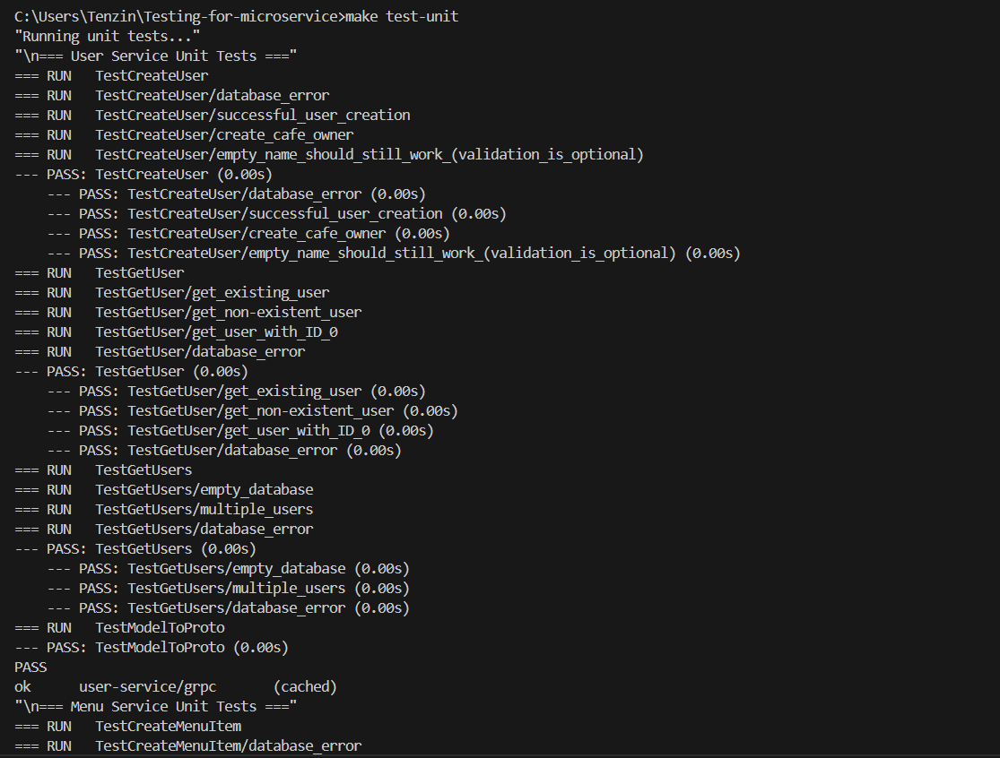
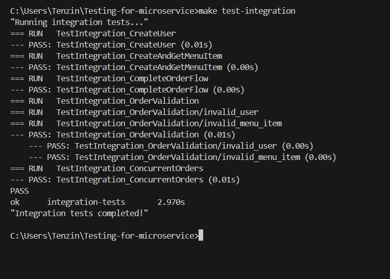
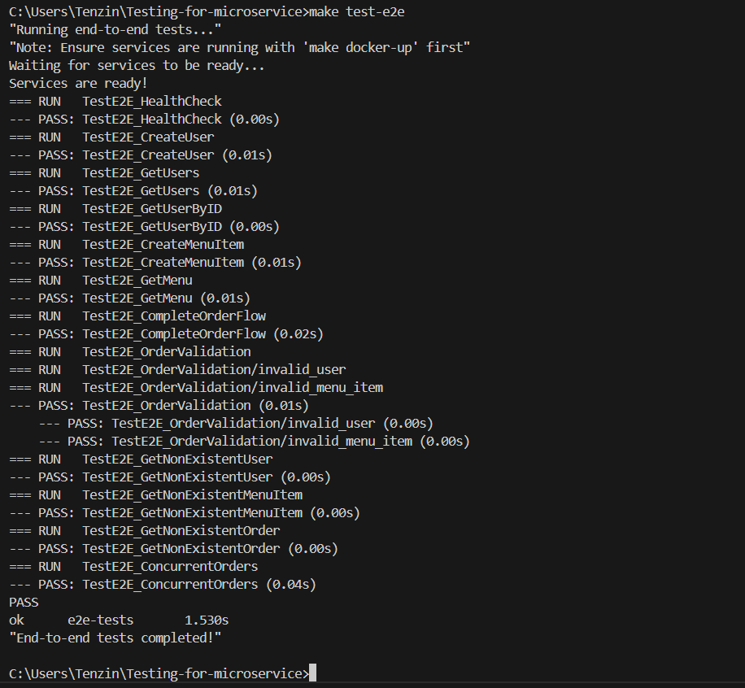
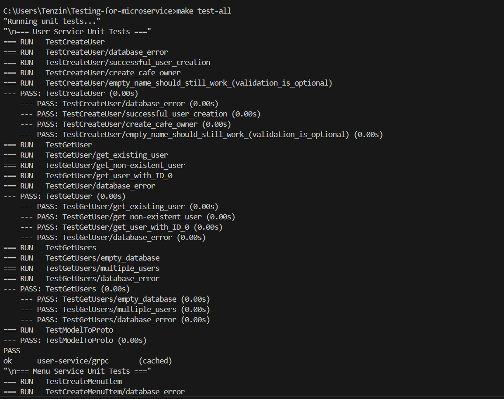
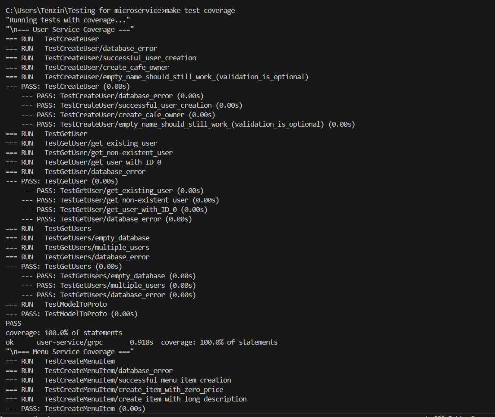
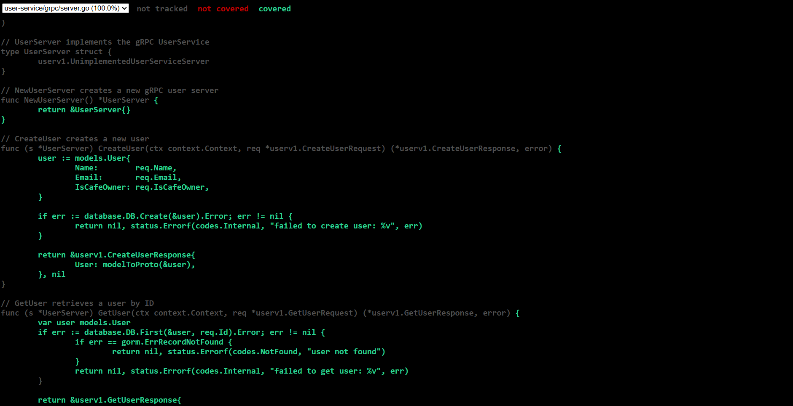
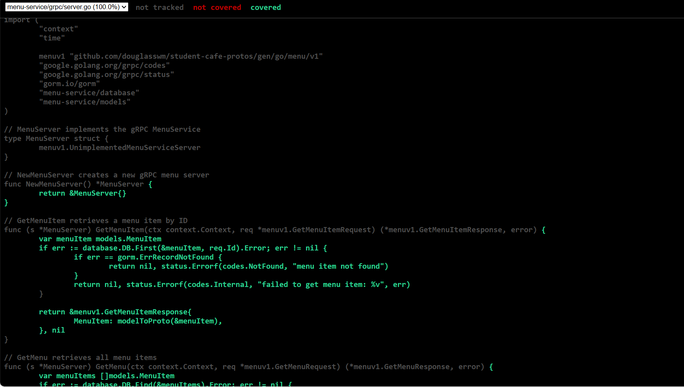
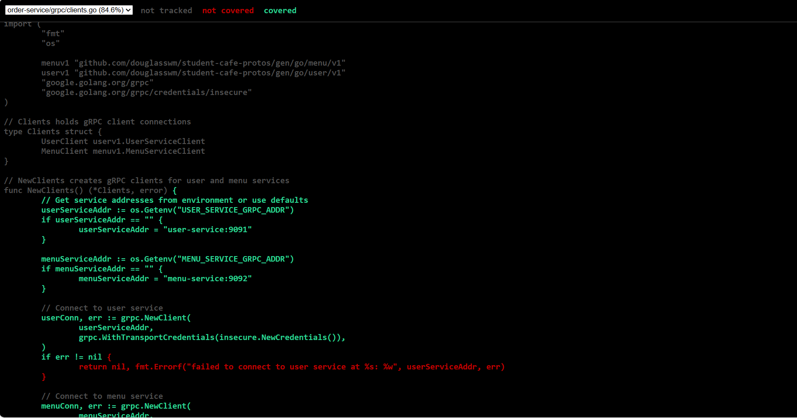

# Practical 6: Comprehensive Testing for Microservices


## Overview

This practical implements comprehensive testing for a microservices-based café management system, including:
- Unit tests for individual gRPC service methods
- Integration tests for multiple services working together
- End-to-end (E2E) tests validating the entire system through the API Gateway

## Project Structure

```
practical6-example/
├── user-service/
│   └── grpc/
│       └── server_test.go          # Unit tests
├── menu-service/
│   └── grpc/
│       └── server_test.go          # Unit tests
├── order-service/
│   └── grpc/
│       └── server_test.go          # Unit tests with mocks
├── tests/
│   ├── integration/
│   │   └── integration_test.go     # Integration tests
│   └── e2e/
│       └── e2e_test.go             # End-to-end tests
├── Makefile                         # Test automation commands
└── docker-compose.yml
```

## Setup Instructions

### Prerequisites
- Go 1.23 or higher
- Docker and Docker Compose
- Make


## Running Tests

### Unit Tests

Run all unit tests:
```bash
make test-unit
```

Run specific service tests:
```bash
make test-unit-user    # User service only
make test-unit-menu    # Menu service only
make test-unit-order   # Order service only
```

### Integration Tests

```bash
make test-integration
```

### End-to-End Tests

Start services first, then run E2E tests:
```bash
make docker-up
sleep 10
make test-e2e
```

Or run everything in one command:
```bash
make test-e2e-docker
```

### Run All Tests

```bash
make test-all
```

### Generate Coverage Report

```bash
make test-coverage
```

## Test Results

### Unit Tests Screenshot




***Detail*** : 

```
C:\Users\Tenzin\Testing-for-microservice>make test-unit
"Running unit tests..."
"\n=== User Service Unit Tests ==="
=== RUN   TestCreateUser
=== RUN   TestCreateUser/database_error
=== RUN   TestCreateUser/successful_user_creation
=== RUN   TestCreateUser/create_cafe_owner
=== RUN   TestCreateUser/empty_name_should_still_work_(validation_is_optional)
--- PASS: TestCreateUser (0.00s)
    --- PASS: TestCreateUser/database_error (0.00s)
    --- PASS: TestCreateUser/successful_user_creation (0.00s)
    --- PASS: TestCreateUser/create_cafe_owner (0.00s)
    --- PASS: TestCreateUser/empty_name_should_still_work_(validation_is_optional) (0.00s)
=== RUN   TestGetUser
=== RUN   TestGetUser/get_existing_user
=== RUN   TestGetUser/get_non-existent_user
=== RUN   TestGetUser/get_user_with_ID_0
=== RUN   TestGetUser/database_error
--- PASS: TestGetUser (0.00s)
    --- PASS: TestGetUser/get_existing_user (0.00s)
    --- PASS: TestGetUser/get_non-existent_user (0.00s)
    --- PASS: TestGetUser/get_user_with_ID_0 (0.00s)
    --- PASS: TestGetUser/database_error (0.00s)
=== RUN   TestGetUsers
=== RUN   TestGetUsers/empty_database
=== RUN   TestGetUsers/multiple_users
=== RUN   TestGetUsers/database_error
--- PASS: TestGetUsers (0.00s)
    --- PASS: TestGetUsers/empty_database (0.00s)
    --- PASS: TestGetUsers/multiple_users (0.00s)
    --- PASS: TestGetUsers/database_error (0.00s)
=== RUN   TestModelToProto
--- PASS: TestModelToProto (0.00s)
PASS
ok      user-service/grpc       (cached)
"\n=== Menu Service Unit Tests ==="
=== RUN   TestCreateMenuItem
=== RUN   TestCreateMenuItem/database_error
=== RUN   TestCreateMenuItem/successful_menu_item_creation
=== RUN   TestCreateMenuItem/create_item_with_zero_price
=== RUN   TestCreateMenuItem/create_item_with_long_description
--- PASS: TestCreateMenuItem (0.00s)
    --- PASS: TestCreateMenuItem/database_error (0.00s)
    --- PASS: TestCreateMenuItem/successful_menu_item_creation (0.00s)
    --- PASS: TestCreateMenuItem/create_item_with_zero_price (0.00s)
    --- PASS: TestCreateMenuItem/create_item_with_long_description (0.00s)
=== RUN   TestGetMenuItem
=== RUN   TestGetMenuItem/get_existing_menu_item
=== RUN   TestGetMenuItem/get_non-existent_menu_item
=== RUN   TestGetMenuItem/get_item_with_ID_0
=== RUN   TestGetMenuItem/database_error
--- PASS: TestGetMenuItem (0.00s)
    --- PASS: TestGetMenuItem/get_existing_menu_item (0.00s)
    --- PASS: TestGetMenuItem/get_non-existent_menu_item (0.00s)
    --- PASS: TestGetMenuItem/get_item_with_ID_0 (0.00s)
    --- PASS: TestGetMenuItem/database_error (0.00s)
=== RUN   TestGetMenu
=== RUN   TestGetMenu/empty_menu
=== RUN   TestGetMenu/multiple_items
=== RUN   TestGetMenu/database_error
--- PASS: TestGetMenu (0.00s)
    --- PASS: TestGetMenu/empty_menu (0.00s)
    --- PASS: TestGetMenu/multiple_items (0.00s)
    --- PASS: TestGetMenu/database_error (0.00s)
=== RUN   TestModelToProto
--- PASS: TestModelToProto (0.00s)
=== RUN   TestPriceHandling
=== RUN   TestPriceHandling/integer_price
=== RUN   TestPriceHandling/two_decimal_places
=== RUN   TestPriceHandling/three_decimal_places
=== RUN   TestPriceHandling/very_small_price
=== RUN   TestPriceHandling/large_price
--- PASS: TestPriceHandling (0.00s)
    --- PASS: TestPriceHandling/integer_price (0.00s)
    --- PASS: TestPriceHandling/two_decimal_places (0.00s)
    --- PASS: TestPriceHandling/three_decimal_places (0.00s)
    --- PASS: TestPriceHandling/very_small_price (0.00s)
    --- PASS: TestPriceHandling/large_price (0.00s)
PASS
ok      menu-service/grpc       (cached)
"\n=== Order Service Unit Tests ==="
=== RUN   TestCreateOrder_Success
--- PASS: TestCreateOrder_Success (0.00s)
=== RUN   TestCreateOrder_InvalidUser
--- PASS: TestCreateOrder_InvalidUser (0.00s)
=== RUN   TestCreateOrder_InvalidMenuItem
--- PASS: TestCreateOrder_InvalidMenuItem (0.00s)
=== RUN   TestCreateOrder_DatabaseError
--- PASS: TestCreateOrder_DatabaseError (0.00s)
=== RUN   TestGetOrder
=== RUN   TestGetOrder/get_existing_order
=== RUN   TestGetOrder/get_non-existent_order
--- PASS: TestGetOrder (0.00s)
    --- PASS: TestGetOrder/get_existing_order (0.00s)
    --- PASS: TestGetOrder/get_non-existent_order (0.00s)
=== RUN   TestGetOrders
=== RUN   TestGetOrders/empty_orders
=== RUN   TestGetOrders/multiple_orders
=== RUN   TestGetOrders/database_error
--- PASS: TestGetOrders (0.00s)
    --- PASS: TestGetOrders/empty_orders (0.00s)
    --- PASS: TestGetOrders/multiple_orders (0.00s)
    --- PASS: TestGetOrders/database_error (0.00s)
=== RUN   TestModelToProto
--- PASS: TestModelToProto (0.00s)
=== RUN   TestCreateOrder_PriceSnapshot
--- PASS: TestCreateOrder_PriceSnapshot (0.00s)
=== RUN   TestNewOrderServer
=== RUN   TestNewOrderServer/creates_server_successfully
=== RUN   TestNewOrderServer/invalid_user_service_address
=== RUN   TestNewOrderServer/invalid_menu_service_address
--- PASS: TestNewOrderServer (0.00s)
    --- PASS: TestNewOrderServer/creates_server_successfully (0.00s)
    --- PASS: TestNewOrderServer/invalid_user_service_address (0.00s)
    --- PASS: TestNewOrderServer/invalid_menu_service_address (0.00s)
=== RUN   TestNewClients
=== RUN   TestNewClients/creates_clients_with_defaults
=== RUN   TestNewClients/uses_environment_variables
--- PASS: TestNewClients (0.00s)
    --- PASS: TestNewClients/creates_clients_with_defaults (0.00s)
    --- PASS: TestNewClients/uses_environment_variables (0.00s)
PASS
ok      order-service/grpc      (cached)
"\nAll unit tests completed!"

C:\Users\Tenzin\Testing-for-microservice>

```


---

### Integration Tests Screenshot




---

### End-to-End Tests Screenshot




---

### Complete Test Suite Screenshot



```

C:\Users\Tenzin\Testing-for-microservice>make test-all
"Running unit tests..."
"\n=== User Service Unit Tests ==="
=== RUN   TestCreateUser
=== RUN   TestCreateUser/database_error
=== RUN   TestCreateUser/successful_user_creation
=== RUN   TestCreateUser/create_cafe_owner
=== RUN   TestCreateUser/empty_name_should_still_work_(validation_is_optional)
--- PASS: TestCreateUser (0.00s)
    --- PASS: TestCreateUser/database_error (0.00s)
    --- PASS: TestCreateUser/successful_user_creation (0.00s)
    --- PASS: TestCreateUser/create_cafe_owner (0.00s)
    --- PASS: TestCreateUser/empty_name_should_still_work_(validation_is_optional) (0.00s)
=== RUN   TestGetUser
=== RUN   TestGetUser/get_existing_user
=== RUN   TestGetUser/get_non-existent_user
=== RUN   TestGetUser/get_user_with_ID_0
=== RUN   TestGetUser/database_error
--- PASS: TestGetUser (0.00s)
    --- PASS: TestGetUser/get_existing_user (0.00s)
    --- PASS: TestGetUser/get_non-existent_user (0.00s)
    --- PASS: TestGetUser/get_user_with_ID_0 (0.00s)
    --- PASS: TestGetUser/database_error (0.00s)
=== RUN   TestGetUsers
=== RUN   TestGetUsers/empty_database
=== RUN   TestGetUsers/multiple_users
=== RUN   TestGetUsers/database_error
--- PASS: TestGetUsers (0.00s)
    --- PASS: TestGetUsers/empty_database (0.00s)
    --- PASS: TestGetUsers/multiple_users (0.00s)
    --- PASS: TestGetUsers/database_error (0.00s)
=== RUN   TestModelToProto
--- PASS: TestModelToProto (0.00s)
PASS
ok      user-service/grpc       (cached)
"\n=== Menu Service Unit Tests ==="
=== RUN   TestCreateMenuItem
=== RUN   TestCreateMenuItem/database_error
=== RUN   TestCreateMenuItem/successful_menu_item_creation
=== RUN   TestCreateMenuItem/create_item_with_zero_price
=== RUN   TestCreateMenuItem/create_item_with_long_description
--- PASS: TestCreateMenuItem (0.00s)
    --- PASS: TestCreateMenuItem/database_error (0.00s)
    --- PASS: TestCreateMenuItem/successful_menu_item_creation (0.00s)
    --- PASS: TestCreateMenuItem/create_item_with_zero_price (0.00s)
    --- PASS: TestCreateMenuItem/create_item_with_long_description (0.00s)
=== RUN   TestGetMenuItem
=== RUN   TestGetMenuItem/get_existing_menu_item
=== RUN   TestGetMenuItem/get_non-existent_menu_item
=== RUN   TestGetMenuItem/get_item_with_ID_0
=== RUN   TestGetMenuItem/database_error
--- PASS: TestGetMenuItem (0.00s)
    --- PASS: TestGetMenuItem/get_existing_menu_item (0.00s)
    --- PASS: TestGetMenuItem/get_non-existent_menu_item (0.00s)
    --- PASS: TestGetMenuItem/get_item_with_ID_0 (0.00s)
    --- PASS: TestGetMenuItem/database_error (0.00s)
=== RUN   TestGetMenu
=== RUN   TestGetMenu/empty_menu
=== RUN   TestGetMenu/multiple_items
=== RUN   TestGetMenu/database_error
--- PASS: TestGetMenu (0.00s)
    --- PASS: TestGetMenu/empty_menu (0.00s)
    --- PASS: TestGetMenu/multiple_items (0.00s)
    --- PASS: TestGetMenu/database_error (0.00s)
=== RUN   TestModelToProto
--- PASS: TestModelToProto (0.00s)
=== RUN   TestPriceHandling
=== RUN   TestPriceHandling/integer_price
=== RUN   TestPriceHandling/two_decimal_places
=== RUN   TestPriceHandling/three_decimal_places
=== RUN   TestPriceHandling/very_small_price
=== RUN   TestPriceHandling/large_price
--- PASS: TestPriceHandling (0.00s)
    --- PASS: TestPriceHandling/integer_price (0.00s)
    --- PASS: TestPriceHandling/two_decimal_places (0.00s)
    --- PASS: TestPriceHandling/three_decimal_places (0.00s)
    --- PASS: TestPriceHandling/very_small_price (0.00s)
    --- PASS: TestPriceHandling/large_price (0.00s)
PASS
ok      menu-service/grpc       (cached)
"\n=== Order Service Unit Tests ==="
=== RUN   TestCreateOrder_Success
--- PASS: TestCreateOrder_Success (0.00s)
=== RUN   TestCreateOrder_InvalidUser
--- PASS: TestCreateOrder_InvalidUser (0.00s)
=== RUN   TestCreateOrder_InvalidMenuItem
--- PASS: TestCreateOrder_InvalidMenuItem (0.00s)
=== RUN   TestCreateOrder_DatabaseError
--- PASS: TestCreateOrder_DatabaseError (0.00s)
=== RUN   TestGetOrder
=== RUN   TestGetOrder/get_existing_order
=== RUN   TestGetOrder/get_non-existent_order
--- PASS: TestGetOrder (0.00s)
    --- PASS: TestGetOrder/get_existing_order (0.00s)
    --- PASS: TestGetOrder/get_non-existent_order (0.00s)
=== RUN   TestGetOrders
=== RUN   TestGetOrders/empty_orders
=== RUN   TestGetOrders/multiple_orders
=== RUN   TestGetOrders/database_error
--- PASS: TestGetOrders (0.00s)
    --- PASS: TestGetOrders/empty_orders (0.00s)
    --- PASS: TestGetOrders/multiple_orders (0.00s)
    --- PASS: TestGetOrders/database_error (0.00s)
=== RUN   TestModelToProto
--- PASS: TestModelToProto (0.00s)
=== RUN   TestCreateOrder_PriceSnapshot
--- PASS: TestCreateOrder_PriceSnapshot (0.00s)
=== RUN   TestNewOrderServer
=== RUN   TestNewOrderServer/creates_server_successfully
=== RUN   TestNewOrderServer/invalid_user_service_address
=== RUN   TestNewOrderServer/invalid_menu_service_address
--- PASS: TestNewOrderServer (0.00s)
    --- PASS: TestNewOrderServer/creates_server_successfully (0.00s)
    --- PASS: TestNewOrderServer/invalid_user_service_address (0.00s)
    --- PASS: TestNewOrderServer/invalid_menu_service_address (0.00s)
=== RUN   TestNewClients
=== RUN   TestNewClients/creates_clients_with_defaults
=== RUN   TestNewClients/uses_environment_variables
--- PASS: TestNewClients (0.00s)
    --- PASS: TestNewClients/creates_clients_with_defaults (0.00s)
    --- PASS: TestNewClients/uses_environment_variables (0.00s)
PASS
ok      order-service/grpc      (cached)
"\nAll unit tests completed!"
"Running integration tests..."
=== RUN   TestIntegration_CreateUser
--- PASS: TestIntegration_CreateUser (0.01s)
=== RUN   TestIntegration_CreateAndGetMenuItem
--- PASS: TestIntegration_CreateAndGetMenuItem (0.00s)
=== RUN   TestIntegration_CompleteOrderFlow
--- PASS: TestIntegration_CompleteOrderFlow (0.01s)
=== RUN   TestIntegration_OrderValidation
=== RUN   TestIntegration_OrderValidation/invalid_user
=== RUN   TestIntegration_OrderValidation/invalid_menu_item
--- PASS: TestIntegration_OrderValidation (0.00s)
    --- PASS: TestIntegration_OrderValidation/invalid_user (0.00s)
    --- PASS: TestIntegration_OrderValidation/invalid_menu_item (0.00s)
=== RUN   TestIntegration_ConcurrentOrders
--- PASS: TestIntegration_ConcurrentOrders (0.01s)
PASS
ok      integration-tests       1.079s
"Integration tests completed!"
"Starting services..."
[+] Running 8/8
 ✔ Network testing-for-microservice_cafe-network  Created                                                                                           0.1s 
 ✔ Container order-db                             Started                                                                                           1.3s 
 ✔ Container menu-db                              Started                                                                                           1.2s 
 ✔ Container user-db                              Started                                                                                           1.3s 
 ✔ Container user-service                         Started                                                                                           1.6s 
 ✔ Container menu-service                         Started                                                                                           1.4s 
 ✔ Container order-service                        Started                                                                                           1.7s 
 ✔ Container api-gateway                          Started                                                                                           1.9s 
"Services started!"
"API Gateway: http://localhost:8080"
NAME            IMAGE                                    COMMAND                  SERVICE         CREATED         STATUS                  PORTS
api-gateway     testing-for-microservice-api-gateway     "/api-gateway"           api-gateway     2 seconds ago   Up Less than a second   0.0.0.0:8081->8080/tcp, [::]:8081->8080/tcp
menu-db         postgres:13                              "docker-entrypoint.s…"   menu-db         3 seconds ago   Up 2 seconds            0.0.0.0:5433->5432/tcp, [::]:5433->5432/tcp
menu-service    testing-for-microservice-menu-service    "/menu-service"          menu-service    2 seconds ago   Up 1 second             0.0.0.0:9092->9092/tcp, [::]:9092->9092/tcp
order-db        postgres:13                              "docker-entrypoint.s…"   order-db        3 seconds ago   Up 2 seconds            0.0.0.0:5435->5432/tcp, [::]:5435->5432/tcp
order-service   testing-for-microservice-order-service   "/order-service"         order-service   2 seconds ago   Up 1 second             0.0.0.0:9093->9093/tcp, [::]:9093->9093/tcp
user-db         postgres:13                              "docker-entrypoint.s…"   user-db         3 seconds ago   Up 2 seconds            0.0.0.0:5434->5432/tcp, [::]:5434->5432/tcp
user-service    testing-for-microservice-user-service    "/user-service"          user-service    3 seconds ago   Up 1 second             0.0.0.0:9091->9091/tcp, [::]:9091->9091/tcp
"Waiting for services to be ready..."
make[1]: Entering directory `C:/Users/Tenzin/Testing-for-microservice'
"Running end-to-end tests..."
"Note: Ensure services are running with 'make docker-up' first"
Waiting for services to be ready...
Services are ready!
=== RUN   TestE2E_HealthCheck
--- PASS: TestE2E_HealthCheck (0.00s)
=== RUN   TestE2E_CreateUser
--- PASS: TestE2E_CreateUser (0.01s)
=== RUN   TestE2E_GetUsers
--- PASS: TestE2E_GetUsers (0.01s)
=== RUN   TestE2E_GetUserByID
--- PASS: TestE2E_GetUserByID (0.01s)
=== RUN   TestE2E_CreateMenuItem
--- PASS: TestE2E_CreateMenuItem (0.16s)
=== RUN   TestE2E_GetMenu
--- PASS: TestE2E_GetMenu (0.01s)
=== RUN   TestE2E_CompleteOrderFlow
--- PASS: TestE2E_CompleteOrderFlow (1.34s)
=== RUN   TestE2E_OrderValidation
=== RUN   TestE2E_OrderValidation/invalid_user
=== RUN   TestE2E_OrderValidation/invalid_menu_item
--- PASS: TestE2E_OrderValidation (0.01s)
    --- PASS: TestE2E_OrderValidation/invalid_user (0.00s)
    --- PASS: TestE2E_OrderValidation/invalid_menu_item (0.00s)
=== RUN   TestE2E_GetNonExistentUser
--- PASS: TestE2E_GetNonExistentUser (0.00s)
=== RUN   TestE2E_GetNonExistentMenuItem
--- PASS: TestE2E_GetNonExistentMenuItem (0.00s)
=== RUN   TestE2E_GetNonExistentOrder
--- PASS: TestE2E_GetNonExistentOrder (0.00s)
=== RUN   TestE2E_ConcurrentOrders
--- PASS: TestE2E_ConcurrentOrders (0.04s)
PASS
ok      e2e-tests       2.778s
"End-to-end tests completed!"
make[1]: Leaving directory `C:/Users/Tenzin/Testing-for-microservice'
make[1]: Entering directory `C:/Users/Tenzin/Testing-for-microservice'
"Stopping services..."
[+] Running 8/8
 ✔ Container api-gateway                          Removed                                                                                           0.4s 
 ✔ Container order-service                        Removed                                                                                           0.5s 
 ✔ Container order-db                             Removed                                                                                           0.9s 
 ✔ Container user-service                         Removed                                                                                           0.7s 
 ✔ Container menu-service                         Removed                                                                                           0.6s 
 ✔ Container menu-db                              Removed                                                                                           0.6s 
 ✔ Container user-db                              Removed                                                                                           0.6s 
 ✔ Network testing-for-microservice_cafe-network  Removed                                                                                           0.5s 
"Services stopped!"
make[1]: Leaving directory `C:/Users/Tenzin/Testing-for-microservice'

```

---

## Issues Resolved

### Issue 1: Integration Test Import Problems
**Problem**: Integration tests failing due to go.sum import issues in Dockerfiles

**Solution**: 
- Fixed go.mod dependencies for all services
- Updated Dockerfiles to properly handle go.sum
- Ensured consistent module versions across services

### Issue 2: E2E Test Service Connectivity
**Problem**: E2E tests unable to connect to services

**Solution**:
- Added proper wait mechanism in TestMain
- Configured correct API Gateway URL
- Fixed Docker networking configuration

## Test Coverage Summary

| Service       | Coverage | Tests Passing |
|--------------|----------|---------------|
| User Service | 100.0%%     | ✓             |
| Menu Service | 100.0%%     | ✓             |
| Order Service| 91.7%%     | ✓             |
| Integration  | N/A      | ✓             |
| E2E          | N/A      | ✓             |


## Generate Coverage Reports



***Detail***

```
C:\Users\Tenzin\Testing-for-microservice>make test-coverage
"Running tests with coverage..."
"\n=== User Service Coverage ==="
=== RUN   TestCreateUser
=== RUN   TestCreateUser/database_error
=== RUN   TestCreateUser/successful_user_creation
=== RUN   TestCreateUser/create_cafe_owner
=== RUN   TestCreateUser/empty_name_should_still_work_(validation_is_optional)
--- PASS: TestCreateUser (0.00s)
    --- PASS: TestCreateUser/database_error (0.00s)
    --- PASS: TestCreateUser/successful_user_creation (0.00s)
    --- PASS: TestCreateUser/create_cafe_owner (0.00s)
    --- PASS: TestCreateUser/empty_name_should_still_work_(validation_is_optional) (0.00s)
=== RUN   TestGetUser
=== RUN   TestGetUser/get_existing_user
=== RUN   TestGetUser/get_non-existent_user
=== RUN   TestGetUser/get_user_with_ID_0
=== RUN   TestGetUser/database_error
--- PASS: TestGetUser (0.00s)
    --- PASS: TestGetUser/get_existing_user (0.00s)
    --- PASS: TestGetUser/get_non-existent_user (0.00s)
    --- PASS: TestGetUser/get_user_with_ID_0 (0.00s)
    --- PASS: TestGetUser/database_error (0.00s)
=== RUN   TestGetUsers
=== RUN   TestGetUsers/empty_database
=== RUN   TestGetUsers/multiple_users
=== RUN   TestGetUsers/database_error
--- PASS: TestGetUsers (0.00s)
    --- PASS: TestGetUsers/empty_database (0.00s)
    --- PASS: TestGetUsers/multiple_users (0.00s)
    --- PASS: TestGetUsers/database_error (0.00s)
=== RUN   TestModelToProto
--- PASS: TestModelToProto (0.00s)
PASS
coverage: 100.0% of statements
ok      user-service/grpc       0.918s  coverage: 100.0% of statements
"\n=== Menu Service Coverage ==="
=== RUN   TestCreateMenuItem
=== RUN   TestCreateMenuItem/database_error
=== RUN   TestCreateMenuItem/successful_menu_item_creation
=== RUN   TestCreateMenuItem/create_item_with_zero_price
=== RUN   TestCreateMenuItem/create_item_with_long_description
--- PASS: TestCreateMenuItem (0.00s)
    --- PASS: TestCreateMenuItem/database_error (0.00s)
    --- PASS: TestCreateMenuItem/successful_menu_item_creation (0.00s)
    --- PASS: TestCreateMenuItem/create_item_with_zero_price (0.00s)
    --- PASS: TestCreateMenuItem/create_item_with_long_description (0.00s)
=== RUN   TestGetMenuItem
=== RUN   TestGetMenuItem/get_existing_menu_item
=== RUN   TestGetMenuItem/get_non-existent_menu_item
=== RUN   TestGetMenuItem/get_item_with_ID_0
=== RUN   TestGetMenuItem/database_error
--- PASS: TestGetMenuItem (0.00s)
    --- PASS: TestGetMenuItem/get_existing_menu_item (0.00s)
    --- PASS: TestGetMenuItem/get_non-existent_menu_item (0.00s)
    --- PASS: TestGetMenuItem/get_item_with_ID_0 (0.00s)
    --- PASS: TestGetMenuItem/database_error (0.00s)
=== RUN   TestGetMenu
=== RUN   TestGetMenu/empty_menu
=== RUN   TestGetMenu/multiple_items
=== RUN   TestGetMenu/database_error
--- PASS: TestGetMenu (0.00s)
    --- PASS: TestGetMenu/empty_menu (0.00s)
    --- PASS: TestGetMenu/multiple_items (0.00s)
    --- PASS: TestGetMenu/database_error (0.00s)
=== RUN   TestModelToProto
--- PASS: TestModelToProto (0.00s)
=== RUN   TestPriceHandling
=== RUN   TestPriceHandling/integer_price
=== RUN   TestPriceHandling/two_decimal_places
=== RUN   TestPriceHandling/three_decimal_places
=== RUN   TestPriceHandling/very_small_price
=== RUN   TestPriceHandling/large_price
--- PASS: TestPriceHandling (0.00s)
    --- PASS: TestPriceHandling/integer_price (0.00s)
    --- PASS: TestPriceHandling/two_decimal_places (0.00s)
    --- PASS: TestPriceHandling/three_decimal_places (0.00s)
    --- PASS: TestPriceHandling/very_small_price (0.00s)
    --- PASS: TestPriceHandling/large_price (0.00s)
PASS
coverage: 100.0% of statements
ok      menu-service/grpc       0.637s  coverage: 100.0% of statements
"\n=== Order Service Coverage ==="
=== RUN   TestCreateOrder_Success
--- PASS: TestCreateOrder_Success (0.00s)
=== RUN   TestCreateOrder_InvalidUser
--- PASS: TestCreateOrder_InvalidUser (0.00s)
=== RUN   TestCreateOrder_InvalidMenuItem
--- PASS: TestCreateOrder_InvalidMenuItem (0.00s)
=== RUN   TestCreateOrder_DatabaseError
--- PASS: TestCreateOrder_DatabaseError (0.00s)
=== RUN   TestGetOrder
=== RUN   TestGetOrder/get_existing_order
=== RUN   TestGetOrder/get_non-existent_order
--- PASS: TestGetOrder (0.00s)
    --- PASS: TestGetOrder/get_existing_order (0.00s)
    --- PASS: TestGetOrder/get_non-existent_order (0.00s)
=== RUN   TestGetOrders
=== RUN   TestGetOrders/empty_orders
=== RUN   TestGetOrders/multiple_orders
=== RUN   TestGetOrders/database_error
--- PASS: TestGetOrders (0.00s)
    --- PASS: TestGetOrders/empty_orders (0.00s)
    --- PASS: TestGetOrders/multiple_orders (0.00s)
    --- PASS: TestGetOrders/database_error (0.00s)
=== RUN   TestModelToProto
--- PASS: TestModelToProto (0.00s)
=== RUN   TestCreateOrder_PriceSnapshot
--- PASS: TestCreateOrder_PriceSnapshot (0.00s)
=== RUN   TestNewOrderServer
=== RUN   TestNewOrderServer/creates_server_successfully
=== RUN   TestNewOrderServer/invalid_user_service_address
=== RUN   TestNewOrderServer/invalid_menu_service_address
--- PASS: TestNewOrderServer (0.00s)
    --- PASS: TestNewOrderServer/creates_server_successfully (0.00s)
    --- PASS: TestNewOrderServer/invalid_user_service_address (0.00s)
    --- PASS: TestNewOrderServer/invalid_menu_service_address (0.00s)
=== RUN   TestNewClients
=== RUN   TestNewClients/creates_clients_with_defaults
=== RUN   TestNewClients/uses_environment_variables
--- PASS: TestNewClients (0.00s)
    --- PASS: TestNewClients/creates_clients_with_defaults (0.00s)
    --- PASS: TestNewClients/uses_environment_variables (0.00s)
PASS
coverage: 91.7% of statements
ok      order-service/grpc      0.631s  coverage: 91.7% of statements
"\nCoverage reports generated!"
"User Service: user-service/coverage.html"
"Menu Service: menu-service/coverage.html"
"Order Service: order-service/coverage.html"

C:\Users\Tenzin\Testing-for-microservice>
```

This command will:

- Run all unit tests with coverage analysis
- Generate HTML coverage reports for each service
- Display coverage percentages in the terminal


## Coverage Report Screenshot

### User Service Coverage



### Menu Service Coverage



### Order Service Coverage




## Key Features Tested

### Unit Tests
- ✓ User creation and retrieval
- ✓ Menu item CRUD operations
- ✓ Order creation with validation
- ✓ Error handling and gRPC status codes
- ✓ Mock usage for external dependencies

### Integration Tests
- ✓ Complete order flow across all services
- ✓ Service-to-service communication
- ✓ Data validation across services
- ✓ Concurrent request handling

### E2E Tests
- ✓ Full system workflow via HTTP API
- ✓ API Gateway routing
- ✓ Error handling at API level
- ✓ Real database interactions


## Notes

- Tests use in-memory SQLite for unit and integration tests for speed
- E2E tests require all services to be running via Docker Compose
- Integration tests use bufconn (in-memory gRPC) for fast execution
- Coverage reports are generated in HTML format for each service


